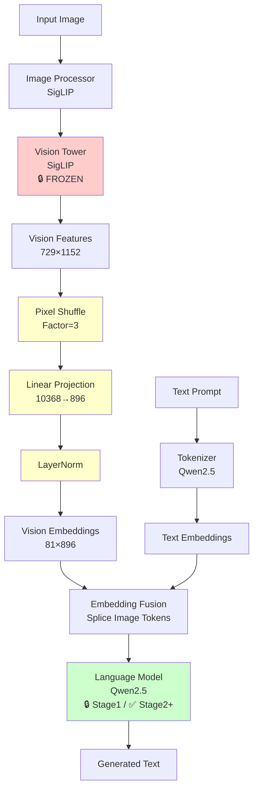
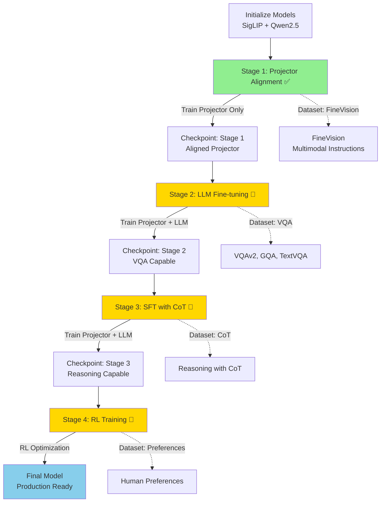

# SiQ-VL: A Vision-Language Model for Multimodal Understanding

## Abstract

SiQ-VL is a vision-language model (VLM) that integrates a SigLIP-based vision encoder with a Qwen2.5 language model through a learnable projection module. The architecture employs a multi-stage training paradigm designed to progressively develop capabilities in multimodal understanding and text generation tasks.

## Architecture Overview

The SiQ-VL architecture comprises three principal components:

1. **Vision Encoder**: A SigLIP-based vision tower that remains frozen throughout the training process
2. **Projection Module**: A learnable projector that transforms vision features into the language model embedding space, incorporating pixel shuffle operations for sequence length compression
3. **Language Model**: A Qwen2.5 transformer-based model responsible for text generation, which remains frozen in Stage 1 and is fine-tuned in subsequent training stages

### Architectural Diagram

<details>
<summary>Model Architecture Diagram (Mermaid)</summary>



</details>

```
┌─────────────────────────────────────────────────────────────────────────────┐
│                           SiQ-VL Model Architecture                         │
└─────────────────────────────────────────────────────────────────────────────┘

    Input Image                    Text Prompt
         │                              │
         │                              │
         ▼                              ▼
    ┌─────────┐                   ┌──────────────┐
    │  Image  │                   │   Tokenizer  │
    │  (PIL)  │                   │   (Qwen2.5)  │
    └────┬────┘                   └───────┬──────┘
         │                                │
         │                                │
         ▼                                ▼
┌────────────────┐                  ┌──────────────┐
│  Image         │                  │  Text Tokens │
│  Processor     │                  │  + Special   │
│  (SigLIP)      │                  │  Tokens      │
└────┬───────────┘                  └──────┬───────┘
     │                                     │
     │                                     │
     ▼                                     │
┌──────────────────────────────────────────┴──────────────────────────────────┐
│                         Vision Tower (SigLIP)                               │
│                         [FROZEN - All Stages]                               │
│                                                                             │
│  ┌──────────┐  ┌──────────┐  ┌──────────┐  ┌──────────┐                     │
│  │  Patch   │→ │  Patch   │→ │  Patch   │→ │  Patch   │→ ...                │
│  │ Embedding│  │ Embedding│  │ Embedding│  │ Embedding│                     │
│  └──────────┘  └──────────┘  └──────────┘  └──────────┘                     │
│                                                                             │
│  Output: [Batch, 729, 1152]  (for 384×384 image, patch_size=14)             │
└────────────────────────────────────┬────────────────────────────────────────┘
                                     │
                                     ▼
┌─────────────────────────────────────────────────────────────────────────────┐
│                    Projector (SiQ_VLModalityProjector)                      │
│                    [TRAINABLE - All Stages]                                 │
│                                                                             │
│  ┌────────────────────────────────────────────────────┐                     │
│  │         Pixel Shuffle (Factor=3)                   │                     │
│  │  [729, 1152] → Reshape → [81, 10368]               │                     │
│  └────────────────────┬───────────────────────────────┘                     │
│                       │                                                     │
│                       ▼                                                     │
│  ┌────────────────────────────────────────────────────┐                     │
│  │         Linear Projection                          │                     │
│  │  [81, 10368] → Linear(10368, 896) → [81, 896]      │                     │
│  └────────────────────┬───────────────────────────────┘                     │
│                       │                                                     │
│                       ▼                                                     │
│  ┌────────────────────────────────────────────────────┐                     │
│  │         LayerNorm                                  │                     │
│  │  Normalize to match LLM embedding distribution     │                     │
│  └────────────────────┬───────────────────────────────┘                     │
│                                                                             │
│  Output: [Batch, 81, 896]  (compressed vision tokens)                       │
└────────────────────────────────────┬────────────────────────────────────────┘
                                     │
                                     │  ┌───────────────────┐
                                     │  │  Text Embeddings  │
                                     │  │  [Batch, Seq, 896]│
                                     │  └────────┬──────────┘
                                     │           │
                                     ▼           ▼
                              ┌─────────────────────────┐
                              │   Embedding Fusion      │
                              │   (Splice Image Tokens) │
                              └────────────┬────────────┘
                                           │
                                           ▼
┌──────────────────────────────────────────────────────────────────────────────┐
│                    Language Model (Qwen2.5)                                  │
│                    [FROZEN - Stage 1] [TRAINABLE - Stage 2+]                 │
│                                                                              │
│  ┌──────────┐  ┌──────────┐  ┌──────────┐  ┌──────────┐                      │
│  │  Layer 1 │→ │  Layer 2 │→ │  Layer 3 │→ │  Layer N │→ ...                 │
│  └──────────┘  └──────────┘  └──────────┘  └──────────┘                      │
│                                                                              │
│  Output: [Batch, Seq, Vocab]  (logits for next token prediction)             │
└────────────────────────────────────┬─────────────────────────────────────────┘
                                     │
                                     ▼
                              ┌──────────────┐
                              │  Generated   │
                              │    Text      │
                              └──────────────┘

Key Dimensions:
  • Vision Features: [Batch, 729, 1152]  (SigLIP SO400M)
  • After Pixel Shuffle: [Batch, 81, 10368]
  • After Projection: [Batch, 81, 896]   (Qwen2.5-0.5B hidden size)
  • LLM Output: [Batch, Seq, Vocab]
```

### Forward Pass Data Flow

```
┌─────────────────────────────────────────────────────────────────────────────┐
│                        Forward Pass Data Flow                               │
└─────────────────────────────────────────────────────────────────────────────┘

Input:
  • Image: PIL.Image (384×384×3)
  • Text: "Describe this image."

Step 1: Image Processing
  Image (384×384×3)
    ↓ [Image Processor]
  Pixel Values [1, 3, 384, 384]
    ↓ [Vision Tower - SigLIP]
  Vision Features [1, 729, 1152]
    │
    ├─ 729 patches = (384/14)²
    └─ 1152 = SigLIP SO400M hidden size

Step 2: Projection with Pixel Shuffle
  Vision Features [1, 729, 1152]
    ↓ [Reshape: 27×27 patches]
  [1, 27, 27, 1152]
    ↓ [Pixel Shuffle: factor=3]
  [1, 9, 9, 10368]  (1152 × 3² = 10368)
    ↓ [Reshape]
  [1, 81, 10368]
    ↓ [Linear Projection: 10368→896]
  [1, 81, 896]
    ↓ [LayerNorm]
  Vision Embeddings [1, 81, 896]
    │
    ├─ 81 tokens (compressed from 729)
    └─ 896 = Qwen2.5-0.5B hidden size

Step 3: Text Processing
  Text: "Describe this image."
    ↓ [Tokenizer + Chat Template]
  Input IDs: [151644, 77091, 198, ..., 151655, ..., 151645]
    │
    ├─ <|im_start|>user\n
    ├─ <|vision_start|><|image_pad|>×81<|vision_end|>
    ├─ Describe this image.
    └─ <|im_end|>
    ↓ [Text Embeddings]
  Text Embeddings [1, Seq, 896]

Step 4: Embedding Fusion
  Text Embeddings: [1, Seq, 896]
    │
    └─ Find <|image_pad|> positions
       │
       ├─ Prefix: [1, prefix_len, 896]
       ├─ Image:  [1, 81, 896]  ← Insert here
       └─ Suffix: [1, suffix_len, 896]
    ↓ [Concatenate]
  Fused Embeddings [1, prefix_len + 81 + suffix_len, 896]

Step 5: LLM Forward Pass
  Fused Embeddings [1, Total_Seq, 896]
    ↓ [Qwen2.5 Transformer]
  Logits [1, Total_Seq, Vocab_Size]
    ↓ [Generate/Decode]
  Output: "The image depicts a beautiful sunset..."

Step 6: Loss Calculation (Training)
  Logits [1, Total_Seq, Vocab_Size]
    │
    └─ Labels [1, Total_Seq]
       │
       ├─ -100 (ignore): Image tokens, prompt tokens
       └─ Token IDs: Answer tokens only
    ↓ [Cross Entropy Loss]
  Loss: scalar
```

### Component Status by Stage

```
┌─────────────────────────────────────────────────────────────────────────────┐
│                    Component Training Status by Stage                       │
└─────────────────────────────────────────────────────────────────────────────┘

Component          │ Stage 1 │ Stage 2 │ Stage 3 │ Stage 4 │
───────────────────┼─────────┼─────────┼─────────┼─────────┤
Vision Tower       │ Frozen  │ Frozen  │ Frozen  │ Frozen  │
(SigLIP)           │         │         │         │         │
───────────────────┼─────────┼─────────┼─────────┼─────────┤
Projector          │ Train   │ Train   │ Train   │ Train   │
                   │         │         │         │         │
───────────────────┼─────────┼─────────┼─────────┼─────────┤
Language Model     │ Frozen  │ Train   │ Train   │ Train   │
(Qwen2.5)          │         │         │         │         │
───────────────────┼─────────┼─────────┼─────────┼─────────┤
RL Components      │  N/A    │  N/A    │  N/A    │ Active  │
                   │         │         │         │         │
```

### Key Design Features

- **Multi-Stage Training Paradigm**: A progressive training strategy that transitions from projector alignment to comprehensive model fine-tuning
- **Pixel Shuffle Compression**: Implements spatial compression to reduce vision token sequence length, improving computational efficiency
- **Automatic Configuration**: Dynamically computes pixel shuffle factors based on vision encoder specifications
- **Distributed Training Support**: Facilitates multi-GPU training through the Accelerate framework
- **Memory Optimization**: Incorporates gradient checkpointing and optimized data loading strategies

## Training Methodology

The SiQ-VL model is trained using a multi-stage approach designed to incrementally develop vision-language capabilities:

### Stage 1: Projector Alignment

**Objective**: Establish alignment between vision encoder outputs and the language model embedding space through supervised training of the projection module exclusively.

- **Frozen Components**: Vision encoder (SigLIP) and language model (Qwen2.5)
- **Trainable Parameters**: Projection module only
- **Training Dataset**: FineVision multimodal instruction-following dataset
- **Purpose**: Initialize vision-language feature alignment
- **Implementation Status**: Fully implemented

### Stage 2: Language Model Fine-tuning on Visual Question Answering

**Objective**: Fine-tune the language model component on large-scale visual question answering datasets to enhance visual comprehension and reasoning capabilities.

- **Frozen Components**: Vision encoder (SigLIP)
- **Trainable Parameters**: Projection module and language model
- **Training Dataset**: Large-scale VQA datasets including VQAv2, GQA, and TextVQA
- **Purpose**: Develop enhanced visual understanding and question-answering capabilities
- **Implementation Status**: Planned for future release

### Stage 3: Supervised Fine-tuning with Chain-of-Thought Reasoning

**Objective**: Fine-tune the model on reasoning datasets annotated with chain-of-thought (CoT) demonstrations to improve step-by-step reasoning and explanatory capabilities.

- **Frozen Components**: Vision encoder (SigLIP)
- **Trainable Parameters**: Projection module and language model
- **Training Dataset**: Visual reasoning datasets with chain-of-thought annotations
- **Purpose**: Develop systematic reasoning and step-by-step explanation capabilities
- **Implementation Status**: Planned for future release

### Stage 4: Reinforcement Learning-based Optimization

**Objective**: Enhance model performance through reinforcement learning techniques, such as reinforcement learning from human feedback (RLHF) or direct preference optimization (DPO), to better align outputs with human preferences.

- **Training Method**: Reinforcement learning-based optimization (specific methodology to be determined)
- **Purpose**: Improve output quality and alignment with human preferences
- **Implementation Status**: Planned for future release

### Training Pipeline Flow Diagram

<details>
<summary>Training Pipeline Visualization (Mermaid)</summary>



</details>

```
┌─────────────────────────────────────────────────────────────────────────────┐
│                         Training Pipeline Overview                          │
└─────────────────────────────────────────────────────────────────────────────┘

    ┌─────────────────────────────────────────────────────────────────────┐
    │  Initialization                                                     │
    │  • Load SigLIP (frozen)                                             │
    │  • Load Qwen2.5 (frozen)                                            │
    │  • Initialize Projector (random weights)                            │
    └───────────────────────────────┬─────────────────────────────────────┘
                                    │
                                    ▼
    ┌─────────────────────────────────────────────────────────────────────┐
    │  STAGE 1: Projector Alignment  [IMPLEMENTED]                        │
    ├─────────────────────────────────────────────────────────────────────┤
    │  Vision Tower: FROZEN                                               │
    │  Projector: TRAINABLE                                               │
    │  LLM: FROZEN                                                        │
    │                                                                     │
    │  Dataset: FineVision                                                │
    │  • Multimodal instruction-following                                 │
    │  • ~10 subsets (coco_colors, sharegpt4v, etc.)                      │
    │                                                                     │
    │  Training:                                                          │
    │  • Learning Rate: 1e-3                                              │
    │  • Steps: ~1000                                                     │
    │  • Objective: Align vision features with LLM space                  │
    └───────────────────────────────┬─────────────────────────────────────┘
                                    │
                                    ▼
                    ┌───────────────────────────┐
                    │  Checkpoint: Stage 1      │
                    │  • Aligned Projector      │
                    │  • Frozen Vision + LLM    │
                    └───────────────┬───────────┘
                                    │
                                    ▼
    ┌─────────────────────────────────────────────────────────────────────┐
    │  STAGE 2: LLM Fine-tuning on VQA  [PLANNED]                         │
    ├─────────────────────────────────────────────────────────────────────┤
    │  Vision Tower: FROZEN                                               │
    │  Projector: TRAINABLE (continue from Stage 1)                       │
    │  LLM: TRAINABLE (unfrozen)                                          │
    │                                                                     │
    │  Dataset: Large VQA Datasets                                        │
    │  • VQAv2, GQA, TextVQA, etc.                                        │
    │  • Focus on visual question answering                               │
    │                                                                     │
    │  Training:                                                          │
    │  • Learning Rate: 1e-5 to 2e-5 (lower for LLM)                      │
    │  • Steps: TBD                                                       │
    │  • Objective: Improve VQA capabilities                              │
    └───────────────────────────────┬─────────────────────────────────────┘
                                    │
                                    ▼
                    ┌───────────────────────────┐
                    │  Checkpoint: Stage 2      │
                    │  • VQA-capable model      │
                    └───────────────┬───────────┘
                                    │
                                    ▼
    ┌─────────────────────────────────────────────────────────────────────┐
    │  STAGE 3: SFT with CoT Reasoning [PLANNED]                          │
    ├─────────────────────────────────────────────────────────────────────┤
    │  Vision Tower: FROZEN                                               │
    │  Projector: TRAINABLE (continue from Stage 2)                       │
    │  LLM: TRAINABLE (continue from Stage 2)                             │
    │                                                                     │
    │  Dataset: Reasoning with Chain-of-Thought                           │
    │  • Step-by-step reasoning annotations                               │
    │  • Visual reasoning tasks                                           │
    │                                                                     │
    │  Training:                                                          │
    │  • Learning Rate: 1e-5 to 2e-5                                      │
    │  • Steps: TBD                                                       │
    │  • Objective: Develop reasoning capabilities                        │
    └───────────────────────────────┬─────────────────────────────────────┘
                                    │
                                    ▼
                    ┌───────────────────────────┐
                    │  Checkpoint: Stage 3      │
                    │  • Reasoning-capable      │
                    └───────────────┬───────────┘
                                    │
                                    ▼
    ┌─────────────────────────────────────────────────────────────────────┐
    │  STAGE 4: Reinforcement Learning [PLANNED]                          │
    ├─────────────────────────────────────────────────────────────────────┤
    │  Vision Tower: FROZEN                                               │
    │  Projector: TRAINABLE (continue from Stage 3)                       │
    │  LLM: TRAINABLE (continue from Stage 3)                             │
    │  RL Components: ACTIVE                                              │
    │                                                                     │
    │  Dataset: Preference Datasets                                       │
    │  • Human feedback data                                              │
    │  • Preference pairs                                                 │
    │                                                                     │
    │  Training:                                                          │
    │  • Method: RLHF / DPO / etc. (TBD)                                  │
    │  • Objective: Align with human preferences                          │
    └───────────────────────────────┬─────────────────────────────────────┘
                                    │
                                    ▼
                    ┌───────────────────────────┐
                    │  Final Model              │
                    │  • Fully aligned VLM      │
                    │  • Production ready       │
                    └───────────────────────────┘
```

### Training Stage Comparison

```
┌─────────────────────────────────────────────────────────────────────────────┐
│                      Training Stage Comparison Table                        │
└─────────────────────────────────────────────────────────────────────────────┘

Feature              │ Stage 1        │ Stage 2        │ Stage 3        │ Stage 4
─────────────────────┼────────────────┼────────────────┼────────────────┼────────────
Status               │ Implemented    │ Planned        │ Planned        │ Planned
─────────────────────┼────────────────┼────────────────┼────────────────┼────────────
Trainable Components │ Projector only │ Projector+LLM  │ Projector+LLM  │ Projector+LLM+RL
─────────────────────┼────────────────┼────────────────┼────────────────┼────────────
Frozen Components    │ Vision + LLM   │ Vision only    │ Vision only    │ Vision only
─────────────────────┼────────────────┼────────────────┼────────────────┼────────────
Learning Rate        │ 1e-3           │ 1e-5 to 2e-5   │ 1e-5 to 2e-5   │ TBD
─────────────────────┼────────────────┼────────────────┼────────────────┼────────────
Training Steps       │ ~1000          │ TBD            │ TBD            │ TBD
─────────────────────┼────────────────┼────────────────┼────────────────┼────────────
Primary Dataset      │ FineVision     │ VQA Datasets   │ CoT Reasoning  │ Preferences
─────────────────────┼────────────────┼────────────────┼────────────────┼────────────
Objective            │ Alignment      │ VQA            │ Reasoning      │ Alignment
─────────────────────┼────────────────┼────────────────┼────────────────┼────────────
Checkpoint Input     │ Base models    │ Stage 1        │ Stage 2        │ Stage 3
─────────────────────┼────────────────┼────────────────┼────────────────┼────────────
Checkpoint Output    │ Stage 1        │ Stage 2        │ Stage 3        │ Final Model
```

## Requirements

### System Requirements

- Python 3.10 (Python >= 3.10 and < 3.11)
- PyTorch >= 2.9.1
- CUDA-capable GPU with at least 24GB VRAM (recommended for training)
- Package manager: [uv](https://github.com/astral-sh/uv) (recommended) or pip

## Installation

### Installation via uv (Recommended)

```bash
# Install uv if not already installed
curl -LsSf https://astral.sh/uv/install.sh | sh

# Clone the repository
git clone <repository-url>
cd SiQ_VL

# Install dependencies
uv sync
```

### Using pip

```bash
pip install -e .
```

## Training Datasets

### Stage 1: FineVision Dataset

Stage 1 training employs the FineVision dataset, available through HuggingFace, which comprises multiple data subsets:

- `coco_colors`
- `densefusion_1m`
- `face_emotion`
- `google_landmarks`
- `laion_gpt4v`
- `sharegpt4o`
- `sharegpt4v(coco)`
- `sharegpt4v(llava)`
- `sharegpt4v(knowledge)`
- `sharegpt4v(sam)`

### Future Training Stages

- **Stage 2**: Large-scale visual question answering datasets (VQAv2, GQA, TextVQA)
- **Stage 3**: Visual reasoning datasets annotated with chain-of-thought demonstrations
- **Stage 4**: Human preference datasets for reinforcement learning optimization

## Training Instructions

> **Note**: Presently, only Stage 1 (Projector Alignment) is fully implemented. Stages 2-4 are planned for future releases.

### Stage 1: Projector Alignment Training

#### Quick Start

The easiest way to start Stage 1 training is using the provided shell script, which auto-detects your environment:

```bash
bash scripts/train_stage_1.sh
```

The script performs the following automatic configurations:
- Detects the computing environment (e.g., MacBook, AWS p4d instances)
- Sets appropriate hyperparameters for Stage 1 training
- Configures distributed training when multiple GPUs are available
- Freezes the language model and trains only the projection module

#### Manual Training

For more control, you can run the training script directly:

```bash
python scripts/train.py \
    --vision_model_name_or_path "google/siglip-so400m-patch14-384" \
    --llm_model_name_or_path "Qwen/Qwen2.5-0.5B-Instruct" \
    --data_path "HuggingFaceM4/FineVision" \
    --sub_sets "coco_colors,densefusion_1m,sharegpt4v(knowledge)" \
    --freeze_llm \
    --output_dir "./checkpoints/siq_vlm_stage1" \
    --per_device_train_batch_size 8 \
    --gradient_accumulation_steps 4 \
    --max_steps 1000 \
    --learning_rate 1e-3 \
    --bf16
```

**Important**: Stage 1 training employs `--freeze_llm` by default, ensuring that only the projection module parameters are updated during this training phase.

### Training Arguments

#### Model Configuration
- `--vision_model_name_or_path`: Path or HuggingFace model ID for vision encoder (default: `google/siglip-so400m-patch14-384`)
- `--llm_model_name_or_path`: Path or HuggingFace model ID for language model (default: `Qwen/Qwen2.5-0.5B-Instruct`)
- `--freeze_llm`: Freeze the LLM during training (default: True)
- `--no_freeze_llm`: Unfreeze the LLM for full fine-tuning
- `--pixel_shuffle_factor`: Manual pixel shuffle factor (auto-calculated if not specified)

#### Dataset Configuration
- `--data_path`: Path to dataset or HuggingFace dataset name (default: `HuggingFaceM4/FineVision`)
- `--sub_sets`: Comma-separated list of dataset subsets to use
- `--max_samples`: Limit dataset size for quick testing
- `--num_proc`: Number of processes for dataset loading (default: 96)
- `--dataloader_num_workers`: Number of dataloader workers (default: 4)

#### Training Hyperparameters
- `--per_device_train_batch_size`: Batch size per device (default: 8)
- `--gradient_accumulation_steps`: Gradient accumulation steps (default: 4)
- `--max_steps`: Maximum training steps (default: 1000)
- `--learning_rate`: Learning rate (default: 1e-3)
- `--bf16`: Use bfloat16 precision (default: True, recommended for Qwen)
- `--fp16`: Use float16 precision (alternative to bf16)

#### Output Configuration
- `--output_dir`: Directory to save checkpoints (default: `./checkpoints/siq_vlm_run1`)
- `--logging_steps`: Steps between logging (default: 10)
- `--save_steps`: Steps between checkpoints (default: 500)
- `--project`: WandB project name (default: `siq_vl_stage_1`)

#### Distributed Training
- `--use_distributed`: Enable distributed training (auto-detected if multiple GPUs available)
- `--no_distributed`: Disable distributed training

### Distributed Training

For multi-GPU training, use Accelerate:

```bash
accelerate launch \
    --dispatch_batches=false \
    --split_batches=false \
    scripts/train.py \
    --freeze_llm \
    --per_device_train_batch_size 8 \
    --gradient_accumulation_steps 4 \
    ...
```

## Project Structure

```
SiQ_VL/
├── siq_vl/              # Main package
│   ├── model.py        # SiQ_VLModel and Projector
│   ├── processing.py   # SiQ_VLProcessor for multimodal inputs
│   ├── dataset.py      # VQAIterableDataset for efficient data loading
│   ├── collator.py     # Data collator for batching
│   └── callbacks.py    # Training callbacks (metrics, GPU cleanup)
├── scripts/
│   ├── train.py        # Main training script (Stage 1)
│   └── train_stage_1.sh # Convenience script for Stage 1 with auto-configuration
│   # Future: train_stage_2.py, train_stage_3.py, train_rl.py
├── checkpoints/         # Saved model checkpoints
│   └── siq_vlm_stage1/ # Stage 1 checkpoints
└── lmms-eval/          # Evaluation framework (optional)
```

## Development Roadmap

- [x] **Stage 1**: Projector alignment training (Completed)
- [ ] **Stage 2**: Language model fine-tuning on large-scale VQA datasets
- [ ] **Stage 3**: Supervised fine-tuning with chain-of-thought reasoning
- [ ] **Stage 4**: Reinforcement learning-based training (RLHF/DPO)
- [ ] Evaluation scripts and benchmark integration
- [ ] Model inference and deployment utilities

## Model Specifications

### Vision Encoder Specifications

- **Model Architecture**: SigLIP (SigLIP 2 SO400M or base model variants)
- **Training Status**: Parameters remain frozen throughout all training stages
- **Output Characteristics**: Produces vision features with configurable patch size and image resolution settings

### Projection Module Specifications

- **Architecture Type**: Linear projection layer with pixel shuffle operation
- **Functional Role**: Transforms vision encoder hidden dimensions to match language model embedding dimensions
- **Compression Mechanism**: Pixel shuffle operation reduces sequence length (e.g., 729 tokens → 81 tokens for 384×384 pixel images with shuffle factor of 3)
- **Normalization**: Layer normalization applied for distribution alignment

### Language Model Specifications

- **Model Architecture**: Qwen2.5 (available in 0.5B, 1.5B, and larger parameter variants)
- **Training Status**: 
  - **Stage 1**: Parameters remain frozen; only projection module is trained
  - **Stage 2 and subsequent stages**: Parameters are unfrozen for full fine-tuning
- **Special Token Handling**: Utilizes Qwen's native special tokens including `<|image_pad|>`, `<|vision_start|>`, and `<|vision_end|>`

## Usage Examples

### Loading a Stage 1 Checkpoint

The following code demonstrates how to load a trained Stage 1 checkpoint for inference:

```python
from siq_vl.model import SiQ_VLModel
from siq_vl.processing import SiQ_VLProcessor
from transformers import AutoImageProcessor, AutoTokenizer
from PIL import Image
import torch
import json
import os

# Load checkpoint configuration
checkpoint_dir = "./checkpoints/siq_vlm_stage1"
with open(os.path.join(checkpoint_dir, "model_config.json"), "r") as f:
    model_config = json.load(f)

# Load processor (saved with the model)
processor = SiQ_VLProcessor.from_pretrained(checkpoint_dir)

# Initialize model with saved configuration
model = SiQ_VLModel(
    vision_model_path=model_config["vision_model_path"],
    llm_model_path=model_config["llm_model_path"],
    freeze_llm=True  # Stage 1 uses frozen LLM
)

# Load the trained weights
model.load_state_dict(torch.load(
    os.path.join(checkpoint_dir, "pytorch_model.bin"),
    map_location="cpu"
))
model.eval()

# Prepare inputs
image = Image.open("path/to/image.jpg")
messages = [
    {
        "role": "user",
        "content": [
            {"type": "image"},
            {"type": "text", "text": "Describe this image."}
        ]
    }
]

# Process and forward
inputs = processor(text=messages, images=image, return_tensors="pt")
with torch.no_grad():
    outputs = model(**inputs)

# Generate response (example)
# Note: Full generation code depends on your inference setup
```

### Initializing Model from Base Architectures

The following example demonstrates model initialization from pre-trained base models for Stage 1 training:

```python
model = SiQ_VLModel(
    vision_model_path="google/siglip-so400m-patch14-384",
    llm_model_path="Qwen/Qwen2.5-0.5B-Instruct",
    freeze_llm=True  # Stage 1: freeze LLM
)
```

## Training Notes and Recommendations

### Stage 1 Training Considerations

- **Memory Requirements**: Training requires substantial VRAM. For GPUs with 24GB VRAM, recommended batch sizes range from 4-8 with gradient accumulation enabled.
- **Numerical Precision**: Qwen models exhibit optimal performance with bfloat16 precision. The use of float16 precision is not recommended for Qwen architectures.
- **Overfitting Behavior**: Vision-language models may exhibit rapid overfitting. Approximately 1000 training steps typically suffice for projector alignment in Stage 1.
- **Checkpoint Format**: Models are saved in PyTorch format (`.bin` files) to circumvent potential safetensors compatibility issues.
- **Learning Rate Selection**: Stage 1 employs a learning rate of 1e-3 for projector alignment. Subsequent stages utilize lower learning rates (1e-5 to 2e-5) for language model fine-tuning.

### Multi-Stage Training Considerations

- **Progressive Checkpoint Loading**: Each training stage builds upon checkpoints from previous stages. Stage 1 checkpoints must be loaded prior to initiating Stage 2 training.
- **Parameter Freezing Strategy**: 
  - Stage 1: Vision encoder and language model parameters remain frozen
  - Stage 2 and subsequent stages: Only vision encoder parameters remain frozen
- **Dataset Progression**: Training stages employ increasingly specialized datasets designed to target specific model capabilities.

## Contributing

Contributions to this project are welcome. Please submit pull requests for review.

## License

This project is licensed under the MIT License:

```
MIT License

Copyright (c) 2025 SiQ-VL Contributors

Permission is hereby granted, free of charge, to any person obtaining a copy
of this software and associated documentation files (the "Software"), to deal
in the Software without restriction, including without limitation the rights
to use, copy, modify, merge, publish, distribute, sublicense, and/or sell
copies of the Software, and to permit persons to whom the Software is
furnished to do so, subject to the following conditions:

The above copyright notice and this permission notice shall be included in all
copies or substantial portions of the Software.

THE SOFTWARE IS PROVIDED "AS IS", WITHOUT WARRANTY OF ANY KIND, EXPRESS OR
IMPLIED, INCLUDING BUT NOT LIMITED TO THE WARRANTIES OF MERCHANTABILITY,
FITNESS FOR A PARTICULAR PURPOSE AND NONINFRINGEMENT. IN NO EVENT SHALL THE
AUTHORS OR COPYRIGHT HOLDERS BE LIABLE FOR ANY CLAIM, DAMAGES OR OTHER
LIABILITY, WHETHER IN AN ACTION OF CONTRACT, TORT OR OTHERWISE, ARISING FROM,
OUT OF OR IN CONNECTION WITH THE SOFTWARE OR THE USE OR OTHER DEALINGS IN THE
SOFTWARE.
```

## Acknowledgments

This work builds upon the following open-source contributions:

- **SigLIP2** (Zhai et al., 2023): Vision encoder architecture implementation [[GitHub](https://arxiv.org/abs/2502.14786)]
- **Qwen2.5** (Qwen Team, 2024): Language model architecture [[GitHub](https://arxiv.org/abs/2412.15115)]
- **HuggingFace Transformers** (Wolf et al., 2020): Deep learning framework [[GitHub](https://github.com/huggingface/transformers)]
- **FineVision Dataset** (HuggingFace, 2025): open dataset for data-centric training of Vision Language Models [[HuggingFace](https://huggingface.co/datasets/HuggingFaceM4/FineVision)]

