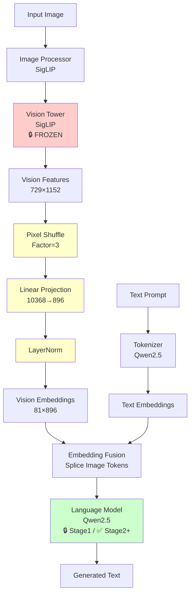
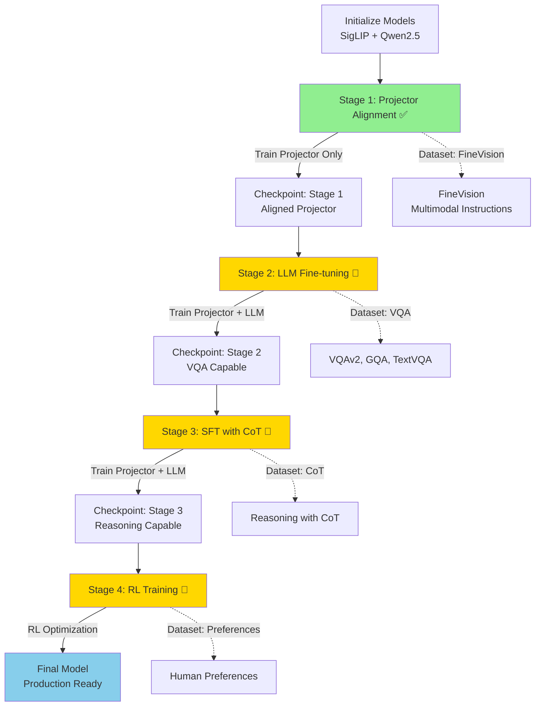

# SiQ-VL: Seek Vision Language Model

SiQ-VL is a Vision-Language Model (VLM) that combines **SigLIP** (vision encoder) with **Qwen2.5** (language model) through a learnable projector. The model is trained from scratch using a multi-stage training pipeline designed for efficient multimodal understanding and generation tasks.

## 🏗️ Architecture

SiQ-VL consists of three main components:

1. **Vision Tower**: SigLIP-based vision encoder (frozen during training)
2. **Projector**: Learnable module that maps vision features to LLM embedding space with pixel shuffle compression
3. **Language Model**: Qwen2.5 for text generation (frozen in Stage 1, fine-tuned in later stages)

### Model Architecture Diagram

<details>
<summary>📊 Click to view Mermaid diagram (if supported)</summary>



</details>

```
┌─────────────────────────────────────────────────────────────────────────────┐
│                           SiQ-VL Model Architecture                         │
└─────────────────────────────────────────────────────────────────────────────┘

    Input Image                    Text Prompt
         │                              │
         │                              │
         ▼                              ▼
    ┌─────────┐                   ┌──────────────┐
    │  Image  │                   │   Tokenizer  │
    │  (PIL)  │                   │   (Qwen2.5)  │
    └────┬────┘                   └──────┬───────┘
         │                                │
         │                                │
         ▼                                ▼
┌────────────────┐                  ┌──────────────┐
│  Image         │                  │  Text Tokens │
│  Processor     │                  │  + Special   │
│  (SigLIP)      │                  │  Tokens      │
└────┬───────────┘                  └──────┬───────┘
     │                                     │
     │                                     │
     ▼                                     │
┌──────────────────────────────────────────┴──────────────────────────────────┐
│                         Vision Tower (SigLIP)                               │
│                         [FROZEN - All Stages]                               │
│                                                                             │
│  ┌──────────┐  ┌──────────┐  ┌──────────┐  ┌──────────┐                     │
│  │  Patch   │→ │  Patch   │→ │  Patch   │→ │  Patch   │→ ...                │
│  │ Embedding│  │ Embedding│  │ Embedding│  │ Embedding│                     │
│  └──────────┘  └──────────┘  └──────────┘  └──────────┘                     │
│                                                                             │
│  Output: [Batch, 729, 1152]  (for 384×384 image, patch_size=14)             │
└────────────────────────────────────┬────────────────────────────────────────┘
                                     │
                                     ▼
┌─────────────────────────────────────────────────────────────────────────────┐
│                    Projector (SiQ_VLModalityProjector)                      │
│                    [TRAINABLE - All Stages]                                 │
│                                                                             │
│  ┌────────────────────────────────────────────────────┐                     │
│  │         Pixel Shuffle (Factor=3)                   │                     │
│  │  [729, 1152] → Reshape → [81, 10368]               │                     │
│  └────────────────────┬───────────────────────────────┘                     │
│                       │                                                     │
│                       ▼                                                     │
│  ┌────────────────────────────────────────────────────┐                     │
│  │         Linear Projection                          │                     │
│  │  [81, 10368] → Linear(10368, 896) → [81, 896]      │                     │
│  └────────────────────┬───────────────────────────────┘                     │
│                       │                                                     │
│                       ▼                                                     │
│  ┌────────────────────────────────────────────────────┐                     │
│  │         LayerNorm                                  │                     │
│  │  Normalize to match LLM embedding distribution     │                     │
│  └────────────────────┬───────────────────────────────┘                     │
│                                                                             │
│  Output: [Batch, 81, 896]  (compressed vision tokens)                       │
└────────────────────────────────────┬────────────────────────────────────────┘
                                     │
                                     │  ┌───────────────────┐
                                     │  │  Text Embeddings  │
                                     │  │  [Batch, Seq, 896]│
                                     │  └────────┬──────────┘
                                     │           │
                                     ▼           ▼
                              ┌─────────────────────────┐
                              │   Embedding Fusion      │
                              │   (Splice Image Tokens) │
                              └────────────┬────────────┘
                                           │
                                           ▼
┌──────────────────────────────────────────────────────────────────────────────┐
│                    Language Model (Qwen2.5)                                  │
│                    [FROZEN - Stage 1] [TRAINABLE - Stage 2+]                 │
│                                                                              │
│  ┌──────────┐  ┌──────────┐  ┌──────────┐  ┌──────────┐                      │
│  │  Layer 1 │→ │  Layer 2 │→ │  Layer 3 │→ │  Layer N │→ ...                 │
│  └──────────┘  └──────────┘  └──────────┘  └──────────┘                      │
│                                                                              │
│  Output: [Batch, Seq, Vocab]  (logits for next token prediction)             │
└────────────────────────────────────┬─────────────────────────────────────────┘
                                     │
                                     ▼
                              ┌──────────────┐
                              │  Generated   │
                              │    Text      │
                              └──────────────┘

Key Dimensions:
  • Vision Features: [Batch, 729, 1152]  (SigLIP SO400M)
  • After Pixel Shuffle: [Batch, 81, 10368]
  • After Projection: [Batch, 81, 896]   (Qwen2.5-0.5B hidden size)
  • LLM Output: [Batch, Seq, Vocab]
```

### Forward Pass Data Flow

```
┌─────────────────────────────────────────────────────────────────────────────┐
│                        Forward Pass Data Flow                               │
└─────────────────────────────────────────────────────────────────────────────┘

Input:
  • Image: PIL.Image (384×384×3)
  • Text: "Describe this image."

Step 1: Image Processing
  Image (384×384×3)
    ↓ [Image Processor]
  Pixel Values [1, 3, 384, 384]
    ↓ [Vision Tower - SigLIP]
  Vision Features [1, 729, 1152]
    │
    ├─ 729 patches = (384/14)²
    └─ 1152 = SigLIP SO400M hidden size

Step 2: Projection with Pixel Shuffle
  Vision Features [1, 729, 1152]
    ↓ [Reshape: 27×27 patches]
  [1, 27, 27, 1152]
    ↓ [Pixel Shuffle: factor=3]
  [1, 9, 9, 10368]  (1152 × 3² = 10368)
    ↓ [Reshape]
  [1, 81, 10368]
    ↓ [Linear Projection: 10368→896]
  [1, 81, 896]
    ↓ [LayerNorm]
  Vision Embeddings [1, 81, 896]
    │
    ├─ 81 tokens (compressed from 729)
    └─ 896 = Qwen2.5-0.5B hidden size

Step 3: Text Processing
  Text: "Describe this image."
    ↓ [Tokenizer + Chat Template]
  Input IDs: [151644, 77091, 198, ..., 151655, ..., 151645]
    │
    ├─ <|im_start|>user\n
    ├─ <|vision_start|><|image_pad|>×81<|vision_end|>
    ├─ Describe this image.
    └─ <|im_end|>
    ↓ [Text Embeddings]
  Text Embeddings [1, Seq, 896]

Step 4: Embedding Fusion
  Text Embeddings: [1, Seq, 896]
    │
    └─ Find <|image_pad|> positions
       │
       ├─ Prefix: [1, prefix_len, 896]
       ├─ Image:  [1, 81, 896]  ← Insert here
       └─ Suffix: [1, suffix_len, 896]
    ↓ [Concatenate]
  Fused Embeddings [1, prefix_len + 81 + suffix_len, 896]

Step 5: LLM Forward Pass
  Fused Embeddings [1, Total_Seq, 896]
    ↓ [Qwen2.5 Transformer]
  Logits [1, Total_Seq, Vocab_Size]
    ↓ [Generate/Decode]
  Output: "The image depicts a beautiful sunset..."

Step 6: Loss Calculation (Training)
  Logits [1, Total_Seq, Vocab_Size]
    │
    └─ Labels [1, Total_Seq]
       │
       ├─ -100 (ignore): Image tokens, prompt tokens
       └─ Token IDs: Answer tokens only
    ↓ [Cross Entropy Loss]
  Loss: scalar
```

### Component Status by Stage

```
┌─────────────────────────────────────────────────────────────────────────────┐
│                    Component Training Status by Stage                       │
└─────────────────────────────────────────────────────────────────────────────┘

Component          │ Stage 1 │ Stage 2 │ Stage 3 │ Stage 4 │
───────────────────┼─────────┼─────────┼─────────┼─────────┤
Vision Tower       │ Frozen  │ Frozen  │ Frozen  │ Frozen  │
(SigLIP)           │         │         │         │         │
───────────────────┼─────────┼─────────┼─────────┼─────────┤
Projector          │ Train   │ Train   │ Train   │ Train   │
                   │         │         │         │         │
───────────────────┼─────────┼─────────┼─────────┼─────────┤
Language Model     │ Frozen  │ Train   │ Train   │ Train   │
(Qwen2.5)          │         │         │         │         │
───────────────────┼─────────┼─────────┼─────────┼─────────┤
RL Components      │  N/A    │  N/A    │  N/A    │ Active  │
                   │         │         │         │         │
```

### Key Features

- **Multi-Stage Training**: Progressive training pipeline from projector alignment to full fine-tuning
- **Pixel Shuffle Compression**: Reduces sequence length of vision tokens for better efficiency
- **Auto-configuration**: Automatically calculates pixel shuffle factor based on vision model configuration
- **Distributed Training**: Supports multi-GPU training with Accelerate
- **Memory Efficient**: Gradient checkpointing and optimized data loading

## 🎓 Training Pipeline

SiQ-VL follows a multi-stage training approach to progressively build a capable VLM:

### Stage 1: Projector Alignment ✅ (Implemented)

**Objective**: Align vision features with the LLM embedding space by training only the projector.

- **Frozen Components**: Vision encoder (SigLIP) and LLM (Qwen2.5)
- **Trainable**: Projector only
- **Dataset**: FineVision (multimodal instruction-following)
- **Purpose**: Establish basic vision-language alignment
- **Status**: ✅ Fully implemented

### Stage 2: LLM Fine-tuning on VQA (Planned)

**Objective**: Unfreeze the LLM and train on large-scale VQA datasets to improve visual question answering capabilities.

- **Frozen Components**: Vision encoder (SigLIP)
- **Trainable**: Projector + LLM
- **Dataset**: Large VQA datasets (e.g., VQAv2, GQA, TextVQA, etc.)
- **Purpose**: Enhance visual understanding and reasoning
- **Status**: 🚧 Planned

### Stage 3: Supervised Fine-Tuning (SFT) with CoT (Planned)

**Objective**: Fine-tune on reasoning datasets with Chain-of-Thought (CoT) annotations to improve reasoning capabilities.

- **Frozen Components**: Vision encoder (SigLIP)
- **Trainable**: Projector + LLM
- **Dataset**: Reasoning datasets with CoT annotations
- **Purpose**: Develop step-by-step reasoning and explanation capabilities
- **Status**: 🚧 Planned

### Stage 4: Reinforcement Learning (RL) Training (Planned)

**Objective**: Further improve model performance using reinforcement learning techniques (e.g., RLHF, DPO, etc.).

- **Method**: RL-based optimization (specific method TBD)
- **Purpose**: Align model outputs with human preferences and improve response quality
- **Status**: 🚧 Planned

### Training Pipeline Flow

<details>
<summary>📊 Click to view Mermaid diagram (if supported)</summary>



</details>

```
┌─────────────────────────────────────────────────────────────────────────────┐
│                         Training Pipeline Overview                          │
└─────────────────────────────────────────────────────────────────────────────┘

    ┌─────────────────────────────────────────────────────────────────────┐
    │  Initialization                                                     │
    │  • Load SigLIP (frozen)                                             │
    │  • Load Qwen2.5 (frozen)                                            │
    │  • Initialize Projector (random weights)                            │
    └───────────────────────────────┬─────────────────────────────────────┘
                                    │
                                    ▼
    ┌─────────────────────────────────────────────────────────────────────┐
    │  STAGE 1: Projector Alignment  [IMPLEMENTED]                        │
    ├─────────────────────────────────────────────────────────────────────┤
    │  Vision Tower: FROZEN                                               │
    │  Projector: TRAINABLE                                               │
    │  LLM: FROZEN                                                        │
    │                                                                     │
    │  Dataset: FineVision                                                │
    │  • Multimodal instruction-following                                 │
    │  • ~10 subsets (coco_colors, sharegpt4v, etc.)                      │
    │                                                                     │
    │  Training:                                                          │
    │  • Learning Rate: 1e-3                                              │
    │  • Steps: ~1000                                                     │
    │  • Objective: Align vision features with LLM space                  │
    └───────────────────────────────┬─────────────────────────────────────┘
                                    │
                                    ▼
                    ┌───────────────────────────┐
                    │  Checkpoint: Stage 1      │
                    │  • Aligned Projector      │
                    │  • Frozen Vision + LLM    │
                    └───────────────┬───────────┘
                                    │
                                    ▼
    ┌─────────────────────────────────────────────────────────────────────┐
    │  STAGE 2: LLM Fine-tuning on VQA  [PLANNED]                         │
    ├─────────────────────────────────────────────────────────────────────┤
    │  Vision Tower: FROZEN                                               │
    │  Projector: TRAINABLE (continue from Stage 1)                       │
    │  LLM: TRAINABLE (unfrozen)                                          │
    │                                                                     │
    │  Dataset: Large VQA Datasets                                        │
    │  • VQAv2, GQA, TextVQA, etc.                                        │
    │  • Focus on visual question answering                               │
    │                                                                     │
    │  Training:                                                          │
    │  • Learning Rate: 1e-5 to 2e-5 (lower for LLM)                      │
    │  • Steps: TBD                                                       │
    │  • Objective: Improve VQA capabilities                              │
    └───────────────────────────────┬─────────────────────────────────────┘
                                    │
                                    ▼
                    ┌───────────────────────────┐
                    │  Checkpoint: Stage 2      │
                    │  • VQA-capable model      │
                    └───────────────┬───────────┘
                                    │
                                    ▼
    ┌─────────────────────────────────────────────────────────────────────┐
    │  STAGE 3: SFT with CoT Reasoning [PLANNED]                          │
    ├─────────────────────────────────────────────────────────────────────┤
    │  Vision Tower: FROZEN                                               │
    │  Projector: TRAINABLE (continue from Stage 2)                       │
    │  LLM: TRAINABLE (continue from Stage 2)                             │
    │                                                                     │
    │  Dataset: Reasoning with Chain-of-Thought                           │
    │  • Step-by-step reasoning annotations                               │
    │  • Visual reasoning tasks                                           │
    │                                                                     │
    │  Training:                                                          │
    │  • Learning Rate: 1e-5 to 2e-5                                      │
    │  • Steps: TBD                                                       │
    │  • Objective: Develop reasoning capabilities                        │
    └───────────────────────────────┬─────────────────────────────────────┘
                                    │
                                    ▼
                    ┌───────────────────────────┐
                    │  Checkpoint: Stage 3      │
                    │  • Reasoning-capable      │
                    └───────────────┬───────────┘
                                    │
                                    ▼
    ┌─────────────────────────────────────────────────────────────────────┐
    │  STAGE 4: Reinforcement Learning [PLANNED]                          │
    ├─────────────────────────────────────────────────────────────────────┤
    │  Vision Tower: FROZEN                                               │
    │  Projector: TRAINABLE (continue from Stage 3)                       │
    │  LLM: TRAINABLE (continue from Stage 3)                             │
    │  RL Components: ACTIVE                                              │
    │                                                                     │
    │  Dataset: Preference Datasets                                       │
    │  • Human feedback data                                              │
    │  • Preference pairs                                                 │
    │                                                                     │
    │  Training:                                                          │
    │  • Method: RLHF / DPO / etc. (TBD)                                  │
    │  • Objective: Align with human preferences                          │
    └───────────────────────────────┬─────────────────────────────────────┘
                                    │
                                    ▼
                    ┌───────────────────────────┐
                    │  Final Model              │
                    │  • Fully aligned VLM      │
                    │  • Production ready       │
                    └───────────────────────────┘
```

### Training Stage Comparison

```
┌─────────────────────────────────────────────────────────────────────────────┐
│                      Training Stage Comparison Table                        │
└─────────────────────────────────────────────────────────────────────────────┘

Feature              │ Stage 1        │ Stage 2        │ Stage 3        │ Stage 4
─────────────────────┼────────────────┼────────────────┼────────────────┼────────────
Status               │ Implemented    │ Planned        │ Planned        │ Planned
─────────────────────┼────────────────┼────────────────┼────────────────┼────────────
Trainable Components │ Projector only │ Projector+LLM  │ Projector+LLM  │ Projector+LLM+RL
─────────────────────┼────────────────┼────────────────┼────────────────┼────────────
Frozen Components    │ Vision + LLM   │ Vision only    │ Vision only    │ Vision only
─────────────────────┼────────────────┼────────────────┼────────────────┼────────────
Learning Rate        │ 1e-3           │ 1e-5 to 2e-5   │ 1e-5 to 2e-5   │ TBD
─────────────────────┼────────────────┼────────────────┼────────────────┼────────────
Training Steps       │ ~1000          │ TBD            │ TBD            │ TBD
─────────────────────┼────────────────┼────────────────┼────────────────┼────────────
Primary Dataset      │ FineVision     │ VQA Datasets   │ CoT Reasoning  │ Preferences
─────────────────────┼────────────────┼────────────────┼────────────────┼────────────
Objective            │ Alignment      │ VQA            │ Reasoning      │ Alignment
─────────────────────┼────────────────┼────────────────┼────────────────┼────────────
Checkpoint Input     │ Base models    │ Stage 1        │ Stage 2        │ Stage 3
─────────────────────┼────────────────┼────────────────┼────────────────┼────────────
Checkpoint Output    │ Stage 1        │ Stage 2        │ Stage 3        │ Final Model
```

## 📋 Requirements

- Python >= 3.10, < 3.11
- PyTorch >= 2.9.1
- CUDA-capable GPU (for training, recommended: 24GB+ VRAM)
- [uv](https://github.com/astral-sh/uv) package manager (recommended) or pip

## 🚀 Installation

### Using uv (Recommended)

```bash
# Install uv if not already installed
curl -LsSf https://astral.sh/uv/install.sh | sh

# Clone the repository
git clone <repository-url>
cd SiQ_VL

# Install dependencies
uv sync
```

### Using pip

```bash
pip install -e .
```

## 📊 Datasets

### Stage 1: FineVision Dataset

The **Stage 1** training uses the **FineVision** dataset from HuggingFace, which includes multiple subsets:

- `coco_colors`
- `densefusion_1m`
- `face_emotion`
- `google_landmarks`
- `laion_gpt4v`
- `sharegpt4o`
- `sharegpt4v(coco)`
- `sharegpt4v(llava)`
- `sharegpt4v(knowledge)`
- `sharegpt4v(sam)`

### Future Stages

- **Stage 2**: Large-scale VQA datasets (VQAv2, GQA, TextVQA, etc.)
- **Stage 3**: Reasoning datasets with Chain-of-Thought annotations
- **Stage 4**: Preference datasets for RL training

## 🎯 Training

> **Note**: Currently, only **Stage 1** (Projector Alignment) is implemented. Stages 2-4 are planned for future releases.

### Stage 1: Projector Alignment Training

#### Quick Start

The easiest way to start Stage 1 training is using the provided shell script, which auto-detects your environment:

```bash
bash scripts/train_stage_1.sh
```

The script automatically:
- Detects host type (MacBook, AWS p4d, etc.)
- Sets appropriate hyperparameters for Stage 1
- Configures distributed training if needed
- Freezes LLM and trains only the projector

#### Manual Training

For more control, you can run the training script directly:

```bash
python scripts/train.py \
    --vision_model_name_or_path "google/siglip-so400m-patch14-384" \
    --llm_model_name_or_path "Qwen/Qwen2.5-0.5B-Instruct" \
    --data_path "HuggingFaceM4/FineVision" \
    --sub_sets "coco_colors,densefusion_1m,sharegpt4v(knowledge)" \
    --freeze_llm \
    --output_dir "./checkpoints/siq_vlm_stage1" \
    --per_device_train_batch_size 8 \
    --gradient_accumulation_steps 4 \
    --max_steps 1000 \
    --learning_rate 1e-3 \
    --bf16
```

**Important**: Stage 1 uses `--freeze_llm` by default. Only the projector is trained during this stage.

### Training Arguments

#### Model Configuration
- `--vision_model_name_or_path`: Path or HuggingFace model ID for vision encoder (default: `google/siglip-so400m-patch14-384`)
- `--llm_model_name_or_path`: Path or HuggingFace model ID for language model (default: `Qwen/Qwen2.5-0.5B-Instruct`)
- `--freeze_llm`: Freeze the LLM during training (default: True)
- `--no_freeze_llm`: Unfreeze the LLM for full fine-tuning
- `--pixel_shuffle_factor`: Manual pixel shuffle factor (auto-calculated if not specified)

#### Dataset Configuration
- `--data_path`: Path to dataset or HuggingFace dataset name (default: `HuggingFaceM4/FineVision`)
- `--sub_sets`: Comma-separated list of dataset subsets to use
- `--max_samples`: Limit dataset size for quick testing
- `--num_proc`: Number of processes for dataset loading (default: 96)
- `--dataloader_num_workers`: Number of dataloader workers (default: 4)

#### Training Hyperparameters
- `--per_device_train_batch_size`: Batch size per device (default: 8)
- `--gradient_accumulation_steps`: Gradient accumulation steps (default: 4)
- `--max_steps`: Maximum training steps (default: 1000)
- `--learning_rate`: Learning rate (default: 1e-3)
- `--bf16`: Use bfloat16 precision (default: True, recommended for Qwen)
- `--fp16`: Use float16 precision (alternative to bf16)

#### Output Configuration
- `--output_dir`: Directory to save checkpoints (default: `./checkpoints/siq_vlm_run1`)
- `--logging_steps`: Steps between logging (default: 10)
- `--save_steps`: Steps between checkpoints (default: 500)
- `--project`: WandB project name (default: `siq_vl_stage_1`)

#### Distributed Training
- `--use_distributed`: Enable distributed training (auto-detected if multiple GPUs available)
- `--no_distributed`: Disable distributed training

### Distributed Training

For multi-GPU training, use Accelerate:

```bash
accelerate launch \
    --dispatch_batches=false \
    --split_batches=false \
    scripts/train.py \
    --freeze_llm \
    --per_device_train_batch_size 8 \
    --gradient_accumulation_steps 4 \
    ...
```

## 📁 Project Structure

```
SiQ_VL/
├── siq_vl/              # Main package
│   ├── model.py        # SiQ_VLModel and Projector
│   ├── processing.py   # SiQ_VLProcessor for multimodal inputs
│   ├── dataset.py      # VQAIterableDataset for efficient data loading
│   ├── collator.py     # Data collator for batching
│   └── callbacks.py    # Training callbacks (metrics, GPU cleanup)
├── scripts/
│   ├── train.py        # Main training script (Stage 1)
│   └── train_stage_1.sh # Convenience script for Stage 1 with auto-configuration
│   # Future: train_stage_2.py, train_stage_3.py, train_rl.py
├── checkpoints/         # Saved model checkpoints
│   └── siq_vlm_stage1/ # Stage 1 checkpoints
└── lmms-eval/          # Evaluation framework (optional)
```

## 🗺️ Roadmap

- [x] **Stage 1**: Projector alignment training (Implemented)
- [ ] **Stage 2**: LLM fine-tuning on large VQA datasets
- [ ] **Stage 3**: Supervised fine-tuning with Chain-of-Thought reasoning
- [ ] **Stage 4**: Reinforcement learning training (RLHF/DPO/etc.)
- [ ] Evaluation scripts and benchmarks
- [ ] Model inference and serving utilities

## 🔧 Model Details

### Vision Encoder
- **Model**: SigLIP (SigLIP 2 SO400M or base variants)
- **Status**: Frozen during training
- **Output**: Vision features with configurable patch size and image resolution

### Projector
- **Type**: Linear projection with pixel shuffle
- **Function**: Maps vision hidden dimension to LLM hidden dimension
- **Compression**: Pixel shuffle reduces sequence length (e.g., 729 → 81 tokens for 384x384 images with factor=3)
- **Normalization**: LayerNorm for distribution alignment

### Language Model
- **Model**: Qwen2.5 (0.5B, 1.5B, or larger variants)
- **Status**: 
  - **Stage 1**: Frozen (only projector trained)
  - **Stage 2+**: Unfrozen (full fine-tuning)
- **Special Tokens**: Uses Qwen's native `<|image_pad|>`, `<|vision_start|>`, `<|vision_end|>` tokens

## 💡 Usage Example

### Loading a Stage 1 Checkpoint

```python
from siq_vl.model import SiQ_VLModel
from siq_vl.processing import SiQ_VLProcessor
from transformers import AutoImageProcessor, AutoTokenizer
from PIL import Image
import torch
import json
import os

# Load checkpoint configuration
checkpoint_dir = "./checkpoints/siq_vlm_stage1"
with open(os.path.join(checkpoint_dir, "model_config.json"), "r") as f:
    model_config = json.load(f)

# Load processor (saved with the model)
processor = SiQ_VLProcessor.from_pretrained(checkpoint_dir)

# Initialize model with saved configuration
model = SiQ_VLModel(
    vision_model_path=model_config["vision_model_path"],
    llm_model_path=model_config["llm_model_path"],
    freeze_llm=True  # Stage 1 uses frozen LLM
)

# Load the trained weights
model.load_state_dict(torch.load(
    os.path.join(checkpoint_dir, "pytorch_model.bin"),
    map_location="cpu"
))
model.eval()

# Prepare inputs
image = Image.open("path/to/image.jpg")
messages = [
    {
        "role": "user",
        "content": [
            {"type": "image"},
            {"type": "text", "text": "Describe this image."}
        ]
    }
]

# Process and forward
inputs = processor(text=messages, images=image, return_tensors="pt")
with torch.no_grad():
    outputs = model(**inputs)

# Generate response (example)
# Note: Full generation code depends on your inference setup
```

### Loading from Scratch (for Training)

```python
# Initialize model from base models (for Stage 1 training)
model = SiQ_VLModel(
    vision_model_path="google/siglip-so400m-patch14-384",
    llm_model_path="Qwen/Qwen2.5-0.5B-Instruct",
    freeze_llm=True  # Stage 1: freeze LLM
)
```

## 📝 Training Notes

### Stage 1 Specific Notes

- **Memory Requirements**: Training requires significant VRAM. For 24GB GPUs, use batch size 4-8 with gradient accumulation.
- **Precision**: Qwen models work best with bfloat16. Avoid fp16 for Qwen.
- **Overfitting**: VLMs can overfit quickly. 1000 steps is often sufficient for projector alignment in Stage 1.
- **Checkpointing**: The model saves checkpoints in PyTorch format (`.bin`) to avoid safetensors compatibility issues.
- **Learning Rate**: Stage 1 uses a higher learning rate (1e-3) for projector alignment. Later stages will use lower rates (1e-5 to 2e-5) for LLM fine-tuning.

### Training Pipeline Notes

- **Progressive Training**: Each stage builds upon the previous stage's checkpoint. Always load the Stage 1 checkpoint before starting Stage 2.
- **Component Freezing**: 
  - Stage 1: Vision encoder + LLM frozen
  - Stage 2+: Only vision encoder frozen
- **Dataset Scaling**: Each stage uses progressively more specialized datasets to target specific capabilities.

## 🤝 Contributing

Contributions are welcome! Please feel free to submit a Pull Request.

## 📄 License

[Add your license information here]

## 🙏 Acknowledgments

- [SigLIP2](https://github.com/google-research/big_vision) for the vision encoder
- [Qwen2.5](https://github.com/QwenLM/Qwen2-VL) for the language model
- [HuggingFace Transformers](https://github.com/huggingface/transformers) for the framework
- [FineVision](https://huggingface.co/datasets/HuggingFaceM4/FineVision) for the training dataset

